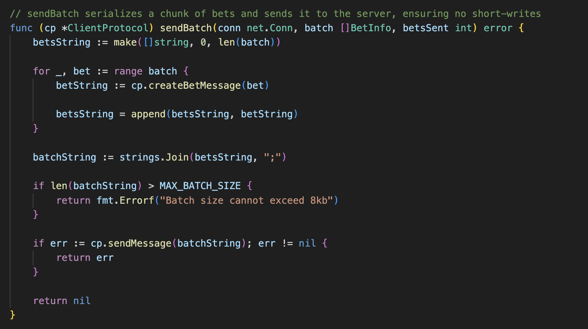

# TP0: Docker + Comunicaciones + Concurrencia

En el presente repositorio se provee un esqueleto básico de cliente/servidor, en donde todas las dependencias del mismo se encuentran encapsuladas en containers. Los alumnos deberán resolver una guía de ejercicios incrementales, teniendo en cuenta las condiciones de entrega descritas al final de este enunciado.

 El cliente (Golang) y el servidor (Python) fueron desarrollados en diferentes lenguajes simplemente para mostrar cómo dos lenguajes de programación pueden convivir en el mismo proyecto con la ayuda de containers, en este caso utilizando [Docker Compose](https://docs.docker.com/compose/).

## Instrucciones de uso
El repositorio cuenta con un **Makefile** que incluye distintos comandos en forma de targets. Los targets se ejecutan mediante la invocación de:  **make \<target\>**. Los target imprescindibles para iniciar y detener el sistema son **docker-compose-up** y **docker-compose-down**, siendo los restantes targets de utilidad para el proceso de depuración.

Los targets disponibles son:

| target  | accion  |
|---|---|
|  `docker-compose-up`  | Inicializa el ambiente de desarrollo. Construye las imágenes del cliente y el servidor, inicializa los recursos a utilizar (volúmenes, redes, etc) e inicia los propios containers. |
| `docker-compose-down`  | Ejecuta `docker-compose stop` para detener los containers asociados al compose y luego  `docker-compose down` para destruir todos los recursos asociados al proyecto que fueron inicializados. Se recomienda ejecutar este comando al finalizar cada ejecución para evitar que el disco de la máquina host se llene de versiones de desarrollo y recursos sin liberar. |
|  `docker-compose-logs` | Permite ver los logs actuales del proyecto. Acompañar con `grep` para lograr ver mensajes de una aplicación específica dentro del compose. |
| `docker-image`  | Construye las imágenes a ser utilizadas tanto en el servidor como en el cliente. Este target es utilizado por **docker-compose-up**, por lo cual se lo puede utilizar para probar nuevos cambios en las imágenes antes de arrancar el proyecto. |
| `build` | Compila la aplicación cliente para ejecución en el _host_ en lugar de en Docker. De este modo la compilación es mucho más veloz, pero requiere contar con todo el entorno de Golang y Python instalados en la máquina _host_. |

### Servidor

Se trata de un "echo server", en donde los mensajes recibidos por el cliente se responden inmediatamente y sin alterar. 

Se ejecutan en bucle las siguientes etapas:

1. Servidor acepta una nueva conexión.
2. Servidor recibe mensaje del cliente y procede a responder el mismo.
3. Servidor desconecta al cliente.
4. Servidor retorna al paso 1.


### Cliente
 se conecta reiteradas veces al servidor y envía mensajes de la siguiente forma:
 
1. Cliente se conecta al servidor.
2. Cliente genera mensaje incremental.
3. Cliente envía mensaje al servidor y espera mensaje de respuesta.
4. Servidor responde al mensaje.
5. Servidor desconecta al cliente.
6. Cliente verifica si aún debe enviar un mensaje y si es así, vuelve al paso 2.

### Ejemplo

Al ejecutar el comando `make docker-compose-up`  y luego  `make docker-compose-logs`, se observan los siguientes logs:

```
client1  | 2024-08-21 22:11:15 INFO     action: config | result: success | client_id: 1 | server_address: server:12345 | loop_amount: 5 | loop_period: 5s | log_level: DEBUG
client1  | 2024-08-21 22:11:15 INFO     action: receive_message | result: success | client_id: 1 | msg: [CLIENT 1] Message N°1
server   | 2024-08-21 22:11:14 DEBUG    action: config | result: success | port: 12345 | listen_backlog: 5 | logging_level: DEBUG
server   | 2024-08-21 22:11:14 INFO     action: accept_connections | result: in_progress
server   | 2024-08-21 22:11:15 INFO     action: accept_connections | result: success | ip: 172.25.125.3
server   | 2024-08-21 22:11:15 INFO     action: receive_message | result: success | ip: 172.25.125.3 | msg: [CLIENT 1] Message N°1
server   | 2024-08-21 22:11:15 INFO     action: accept_connections | result: in_progress
server   | 2024-08-21 22:11:20 INFO     action: accept_connections | result: success | ip: 172.25.125.3
server   | 2024-08-21 22:11:20 INFO     action: receive_message | result: success | ip: 172.25.125.3 | msg: [CLIENT 1] Message N°2
server   | 2024-08-21 22:11:20 INFO     action: accept_connections | result: in_progress
client1  | 2024-08-21 22:11:20 INFO     action: receive_message | result: success | client_id: 1 | msg: [CLIENT 1] Message N°2
server   | 2024-08-21 22:11:25 INFO     action: accept_connections | result: success | ip: 172.25.125.3
server   | 2024-08-21 22:11:25 INFO     action: receive_message | result: success | ip: 172.25.125.3 | msg: [CLIENT 1] Message N°3
client1  | 2024-08-21 22:11:25 INFO     action: receive_message | result: success | client_id: 1 | msg: [CLIENT 1] Message N°3
server   | 2024-08-21 22:11:25 INFO     action: accept_connections | result: in_progress
server   | 2024-08-21 22:11:30 INFO     action: accept_connections | result: success | ip: 172.25.125.3
server   | 2024-08-21 22:11:30 INFO     action: receive_message | result: success | ip: 172.25.125.3 | msg: [CLIENT 1] Message N°4
server   | 2024-08-21 22:11:30 INFO     action: accept_connections | result: in_progress
client1  | 2024-08-21 22:11:30 INFO     action: receive_message | result: success | client_id: 1 | msg: [CLIENT 1] Message N°4
server   | 2024-08-21 22:11:35 INFO     action: accept_connections | result: success | ip: 172.25.125.3
server   | 2024-08-21 22:11:35 INFO     action: receive_message | result: success | ip: 172.25.125.3 | msg: [CLIENT 1] Message N°5
client1  | 2024-08-21 22:11:35 INFO     action: receive_message | result: success | client_id: 1 | msg: [CLIENT 1] Message N°5
server   | 2024-08-21 22:11:35 INFO     action: accept_connections | result: in_progress
client1  | 2024-08-21 22:11:40 INFO     action: loop_finished | result: success | client_id: 1
client1 exited with code 0
```


## Parte 1: Introducción a Docker
En esta primera parte del trabajo práctico se plantean una serie de ejercicios que sirven para introducir las herramientas básicas de Docker que se utilizarán a lo largo de la materia. El entendimiento de las mismas será crucial para el desarrollo de los próximos TPs.

### Ejercicio N°1:
Definir un script de bash `generar-compose.sh` que permita crear una definición de Docker Compose con una cantidad configurable de clientes.  El nombre de los containers deberá seguir el formato propuesto: client1, client2, client3, etc. 

El script deberá ubicarse en la raíz del proyecto y recibirá por parámetro el nombre del archivo de salida y la cantidad de clientes esperados:

`./generar-compose.sh docker-compose-dev.yaml 5`

Considerar que en el contenido del script pueden invocar un subscript de Go o Python:

```
#!/bin/bash
echo "Nombre del archivo de salida: $1"
echo "Cantidad de clientes: $2"
python3 mi-generador.py $1 $2
```

En el archivo de Docker Compose de salida se pueden definir volúmenes, variables de entorno y redes con libertad, pero recordar actualizar este script cuando se modifiquen tales definiciones en los sucesivos ejercicios.

#### Resolución del ejercicio
Se generó un script directamente en bash. Este script primero hace un chequeo de la cantidad de variables recibidas, en caso de que no sea 2 devuelve un código de error 1. Luego hace un chequeo para ver si la cantidad de clientes ingresados es un número entero mayor a 0, en caso de que no lo sea devuelve código de error 2.


Una vez hecho el chequeo de erorres, se comienza a reescribir el archivo de salida, cuyo path esta guardado en la variable `$OUTPUT_FILE`. Con el comando `cat > "$OUTPUT_FILE` se redirige la salida estándar al archivo de salida, reescribiendo su contenido. `<< 'END'` inicia un `here-doc`, que indica que se escriba todo lo que se encuentra a continuación hasta que se encuentre una línea que contenga únicamente el delimitador `END`. 


Una vez escrito el server, se pasan a escribir los clientes. El script realiza un for desde 1 hasta la cantidad de clientes. En cada iteración se escribe un cliente. En este caso se utiliza `cat >> "$OUTPUT_FILE` ya que `>>` indica que se agregue al archivo en vez de sobreescribir.


Por último se vuelve a escribir la red sin modificaciones a la original. 


El resultado final luego de ejecutar para 5 clientes es:


### Ejercicio N°2:
Modificar el cliente y el servidor para lograr que realizar cambios en el archivo de configuración no requiera reconstruír las imágenes de Docker para que los mismos sean efectivos. La configuración a través del archivo correspondiente (`config.ini` y `config.yaml`, dependiendo de la aplicación) debe ser inyectada en el container y persistida por fuera de la imagen (hint: `docker volumes`).

#### Resolución del ejercicio
Se agregaron los volumenes para el servidor y los clientes en el script del `docker-compose-dev.yaml` y se eliminaron las variables de entorno del nivel de logging en ambos casos ya que son parte de la configuración y no deberían estar "hardcodeadas" en el archivo. 


### Ejercicio N°3:
Crear un script de bash `validar-echo-server.sh` que permita verificar el correcto funcionamiento del servidor utilizando el comando `netcat` para interactuar con el mismo. Dado que el servidor es un echo server, se debe enviar un mensaje al servidor y esperar recibir el mismo mensaje enviado.

En caso de que la validación sea exitosa imprimir: `action: test_echo_server | result: success`, de lo contrario imprimir:`action: test_echo_server | result: fail`.

El script deberá ubicarse en la raíz del proyecto. Netcat no debe ser instalado en la máquina _host_ y no se pueden exponer puertos del servidor para realizar la comunicación (hint: `docker network`). `

#### Resolución del ejercicio
El script `validar-echo-server.sh` busca en el archivo `docker-compose-dev.yaml` el nombre del proyecto. El comando `"$(awk '/^[[:space:]]*name:[[:space:]]*/{print $2; exit}' "$COMPOSE_FILE" 2>/dev/null || echo tp0)"` busca en el compose la primera aparición de `name` y asigna su valor a la variable `PROJECT_NAME`. Cabe aclarar que en caso de no encontrar el nombre, se elige por defecto `tp0` ya que era el nombre original. Luego de asignar el nombre del proyecto, asigna el nombre de la red en la variable `NETWORK`


Una vez hecho esto, se busca entre los containers en ejecución al `server`, ya que este es el que maneja la conexión y es a donde se va a enviar el mensaje. En caso de no encontrarlo, el script devuelve `fail` automáticamente sin posibilidad de reconexión.


Si se encontró el container del servidor, se procede a encontrar el puerto por donde enviar la información. Para que no sea un valor hardcodeado, se ejecuta dentro de docker una terminal de python y se lee el archivo `config.ini` del servidor para obtener el puerto. Si no se encontrara un puerto, se asigna el puerto default del archivo, y en caso de que tampoco haya uno se asigna por defecto el puerto `12345`. Aclaración, se usa el puerto `12345` como default ya que en el archivo original del `config.ini` ese era el valor. 

Luego se hace una validación para ver si el puerto leído tiene un valor correcto, es decir, que sea un número.


Una vez obtenido el puerto, se levanta un contenedor temporal de docker con `docker run -rm` y se conecta a `NETWORK` usando alpine, que ejecuta una shell. Envia por `stdin` a `netcat` conectado con `server` en el puerto `PORT` el mensaje inicial sin el salto de línea. 

Por último, chequea que el mensaje original sea igual al mensaje recibido devolviendo según corresponda. 


### Ejercicio N°4:
Modificar servidor y cliente para que ambos sistemas terminen de forma _graceful_ al recibir la signal SIGTERM. Terminar la aplicación de forma _graceful_ implica que todos los _file descriptors_ (entre los que se encuentran archivos, sockets, threads y procesos) deben cerrarse correctamente antes que el thread de la aplicación principal muera. Loguear mensajes en el cierre de cada recurso (hint: Verificar que hace el flag `-t` utilizado en el comando `docker compose down`).

#### Resolución del ejercicio
Resolución en `client`:
En `client/common/client.go` se implementaron las siguientes funciones:
* `closeConnection()`: realiza el cierre del socket, liberando el file descriptor y terminando la comunicación con el server. Esta función fue creada para no estar usando `c.conn.Close()` y mejorar la legibilidad del código


* En `StartClientLoop()` se modificaron algunas cosas. Primero, ahora la función recibe por parámetro un `context.Context` para poder manejar el shutdown. Además en el loop, se chequea si la conexión fue terminada con `ctx.Done()`, y en el caso afirmativo cierra la conexión y termina el loop. 
* Se modificó el sleep entre mensajes, ya que `time.Sleep` bloquea la goroutine y no puede interrumpirse hasta que no pase el tiempo. Se agregó una condición de `select` para que si se interrumpió con un `SIGTERM` durante ese momento no haya que esperar a que termine el sleep para qeu termine la conexión. El sleep ahora se maneja con un `time.After` que sí puede ser interrumpido por una señal de shutdown


En `client/main.go`:
* Se crea un `context` para poder mandar información entre goroutines, junto con su función `cancel`.
* Se crea un canal buffereado `sigChan` que recibe señales del sistema operativo. Como en este caso solamente se pide que se maneje la señal `SIGTERM` el tamaño del buffer es de 1. El canal queda a la espera de señales.
* Se lanza una gorotutine para manejar las señales, con una variable `sig` que se bloquea hasta recibir algo desde `sigChan`. Una vez que recibe, se loguea el shutdown y se llama a la función `cancel()` del `context`


Resolución en `server`:
En `server/common/server.py`:
* Se implementó un flag `_running` que indica si el server está activo


* En `run()` se modificó el loop de iteraciones. Antes era un `while True` y ahora pasa a ser un `while self._running`, que hace que al momento en el que el flag deja de ser `True`, el loop se corte (terminando la iteración actual). La aceptación de nuevas conexiones y el manejo de las conexiones de los clientes está dentro de un bloque `try` ya que si sucede un error quiero poder manejarlo correctamente y que no se corte el programa. Una vez que termina el `while`, se hace un cierre del socket del servidor llamando a la función `__close_server_socket()`.


* Se implementó `shutdown()`, que cambia el valor del flag a `False` y hace un `socket.shutdown(RDWR)`
* Se implementó `__close_server_socket()` que hace un `socket.close()` y libera los recursos.


En `server/main.py`:
* Se implementó `signal_handler()` que recibe el número de señal, el frame (estado actual de la pila de ejecución) y el `server`. Cabe aclarar que si bien `frame` no se utiliza en la función, es necesario que esté en la firma de la función para el handling de señales en python. En esta función se hace el log del shutdown y se llama a `server.shutdown()`. 


* En `main()` se hace el llamado a `signal_handler()` a través de `signal.signal(signal.SIGTERM, lambda signum, frame: signal_handler(signum, frame, server))`. Se usa `lambda` porque `signal.signal` originalmente recibe 2 parámetros, y `lambda` me permite hacer el llamado a `signal_handler()`. Por último, se modificó la línea dónde estaba `server.run()` y ahora está dentro de un bloque `try`, ya que en caso de que falle se debería llamar a `server.shutdown()` y salir con código de error.


## Parte 2: Repaso de Comunicaciones

Las secciones de repaso del trabajo práctico plantean un caso de uso denominado **Lotería Nacional**. Para la resolución de las mismas deberá utilizarse como base el código fuente provisto en la primera parte, con las modificaciones agregadas en el ejercicio 4.

### Ejercicio N°5:
Modificar la lógica de negocio tanto de los clientes como del servidor para nuestro nuevo caso de uso.

#### Cliente
Emulará a una _agencia de quiniela_ que participa del proyecto. Existen 5 agencias. Deberán recibir como variables de entorno los campos que representan la apuesta de una persona: nombre, apellido, DNI, nacimiento, numero apostado (en adelante 'número'). Ej.: `NOMBRE=Santiago Lionel`, `APELLIDO=Lorca`, `DOCUMENTO=30904465`, `NACIMIENTO=1999-03-17` y `NUMERO=7574` respectivamente.

Los campos deben enviarse al servidor para dejar registro de la apuesta. Al recibir la confirmación del servidor se debe imprimir por log: `action: apuesta_enviada | result: success | dni: ${DNI} | numero: ${NUMERO}`.


#### Servidor
Emulará a la _central de Lotería Nacional_. Deberá recibir los campos de la cada apuesta desde los clientes y almacenar la información mediante la función `store_bet(...)` para control futuro de ganadores. La función `store_bet(...)` es provista por la cátedra y no podrá ser modificada por el alumno.
Al persistir se debe imprimir por log: `action: apuesta_almacenada | result: success | dni: ${DNI} | numero: ${NUMERO}`.

#### Comunicación:
Se deberá implementar un módulo de comunicación entre el cliente y el servidor donde se maneje el envío y la recepción de los paquetes, el cual se espera que contemple:
* Definición de un protocolo para el envío de los mensajes.
* Serialización de los datos.
* Correcta separación de responsabilidades entre modelo de dominio y capa de comunicación.
* Correcto empleo de sockets, incluyendo manejo de errores y evitando los fenómenos conocidos como [_short read y short write_](https://cs61.seas.harvard.edu/site/2018/FileDescriptors/).

_Protocolo de comunicacion:_ se planteo un protocolo similar tanto para el cliente como para el servidor.


En el cliente, las apuestas se serializan de la siguiente forma `"BET/<Agencia>/<Nombre>/<Apellido>/<Documento>/<Fecha_de_nacimiento>/<Numero>\n"`. El caracter `\n` delimita el fin del mensaje y es lo que busca el servidor para cortar las lecturas.
* El envio de mensajes se encuentra en el metodo `sendMessage()`. En este, se crea un buffer de bytes con el texto que se quiere enviar junto con un contador de bytes enviados. Primero se envia por el socket el largo del mensaje, en 2 bytes en formato `big endian`. Luego, se entra en un loop en el que se van enviando bytes y actualizando el valor del contador. El loop puede terminar antes de tiempo por un error o puede finalizar correctamente cuando todos los bytes hayan sido enviados, evitando `short writes`


* La recepcion de los mensajes hace algo similar al envio, en la funcion `receiveMessage()` solamente que lee de a 1 byte a la vez. Esto se debe a que en el envio, el protocolo conoce la longitud del mensaje que va a enviar, pero en la recepcion no. Es por esto que hace una lectura de a 1 byte hasta recibir el caracter `\n` que indica el fin del mensaje, evitando de esta forma `short reads`


Por el otro lado, en el servidor, los mensajes de respuesta se serializan de la siguiente forma `"RESPONSE/<success>/<message>\n"` donde `<success>` puede tomar valor `SUCCESS` o `ERROR` dependiendo de si el mensaje recibido era valido.
* El envio de mensajes se encuentra en el metodo `send_message()` y se comporta de forma muy similar al del envio del cliente. La diferencia es que no se envía el tamaño del mensaje ya que el cliente separa los mensajes por el `\n`, y como los mensajes que envía el servidor no tienen saltos de línea intermedios se puede asegurar que habra un único `\n` por mensaje, por lo que no es necesario enviar el tamaño. Se crea un array de bytes y se tiene un contador con los bytes enviados, para luego en loop enviar y actualizar el contador hasta que se termina correctamente y se envia todo u ocurre un error y se termina la comunicacion.


* La recepción de mensajes se encuentra en el método `receive_message()`. Primero lee del socket 2 bytes en formato `big endian` que indican el tamaño del mensaje que se va a recibir. Luego de esto, entra en un loop en el que intenta leer la cantidad de bytes que le faltan para llegar a ese tamaño que se leyó, evitando así `short-reads`


### Ejercicio N°6:
Modificar los clientes para que envíen varias apuestas a la vez (modalidad conocida como procesamiento por _chunks_ o _batchs_). 
Los _batchs_ permiten que el cliente registre varias apuestas en una misma consulta, acortando tiempos de transmisión y procesamiento.

La información de cada agencia será simulada por la ingesta de su archivo numerado correspondiente, provisto por la cátedra dentro de `.data/datasets.zip`.
Los archivos deberán ser inyectados en los containers correspondientes y persistido por fuera de la imagen (hint: `docker volumes`), manteniendo la convencion de que el cliente N utilizara el archivo de apuestas `.data/agency-{N}.csv` .

En el servidor, si todas las apuestas del *batch* fueron procesadas correctamente, imprimir por log: `action: apuesta_recibida | result: success | cantidad: ${CANTIDAD_DE_APUESTAS}`. En caso de detectar un error con alguna de las apuestas, debe responder con un código de error a elección e imprimir: `action: apuesta_recibida | result: fail | cantidad: ${CANTIDAD_DE_APUESTAS}`.

La cantidad máxima de apuestas dentro de cada _batch_ debe ser configurable desde config.yaml. Respetar la clave `batch: maxAmount`, pero modificar el valor por defecto de modo tal que los paquetes no excedan los 8kB. 

Por su parte, el servidor deberá responder con éxito solamente si todas las apuestas del _batch_ fueron procesadas correctamente.

#### Resolución del ejercicio

> [!NOTE] Sobre el protocolo
> El protocolo fue modificado respecto al ejercicio 5. Lo tuve que modificar para realizar este ejercicio y por tiempos preferí continuar en los próximos ejercicios con este nuevo protocolo sin modfificarlo en el ejercicio anterior.

Se modificó el script `generar-compose.sh` para inyectar la persistencia del archivo de apuestas. Además, se quitaron las variables de entorno ya que las apuestas ahora se leen del archivo `.csv` de cada agencia. 


En el cliente, se modificaron las siguientes cosas:
* La lectura del archivo de cada agencia y la carga de las correspondientes apuestas se hace en `loadBetsFromFile` en el archivo `client/common/bet.go`. En esta función, se lee el archivo línea por línea y se cargan los datos. 


* En el archivo `client/common/client.go` se agregó la variable de configuración para el tamaño máximo del batch, que se lee desde el archivo de configuración. Además, en el inicializador del cliente se llama a la lectura del archivo de las apuestas.

* Los cambios más importantes se hicieron en el protocolo. Para comenzar, al ya no ser un único mensaje enviado al servidor, sino que son múltiples _batches_ de datos, fue necesario cambiar el formato de los envíos. En primer lugar, las apuestas pasaron de serializarse de `BET/<Agencia>/<Nombre>/<Apellido>/<Documento>/<Fecha de nacimiento>/<Numero>\n` a serializarse de la forma `<Agencia>/<Nombre>/<Apellido>/<Documento>/<Fecha de nacimiento>/<Numero>`. Lo siguiente que se hizo es que al agrupar varias apuestas en un mismo _batch_ éstas se separaban con un `;`, quedando entonces de la forma `Apuesta1;Apuesta2;Apuesta3;...;ApuestaN`. De esta forma, se reduce la cantidad de bytes por envío, haciendo más eficiente cada transmisión, ya que no se está enviando el tipo de mensaje `BET` antes de cada apuesta. Por otra parte, se modificaron también los métodos de envío de datos. En lugar de `sendBet()`, ahora se cuenta con `sendBets()` que primero envía el total de apuestas que se van a transmitir, y luego hace un loop para cada _batch_ llamando a `sendBatch()` que serializa cada apuesta y las une en una misma tira de bytes para el envío. Cabe aclarar que `sendBatch()` vendría a reemplazar a `sendBet()`, pero aplicado a múltiples apuestas, ya que envía el largo del mensaje y luego transmite los bytes haciendo uso de `sendAll()` que se asegura que no sucedan _short-writes_. Se hicieron modificaciones también en `receiveMessage()`. Se modificó la forma en la que se leía del socket. El uso de `bufio.NewReader` junto con `ReadByte` podían hacer que el socket quede bloqueado aún cuando se hacía un _close_ del mismo. Es por esto que se modificó y ahora se hace la misma lectura de un byte a la vez pero usando un buffer de tamaño 1, con `Conn.Read`, que si se cierra el socket se desbloquea. Por último desde el lado del protocolo del cliente, se agregó un campo `betCount` al struct `ServerResponse` reemplazando al campo `type`, para chequear que el número de apuestas que recibió el servidor sea el mismo que el número de apuestas enviadas por el cliente.





En el servidor se realizaron los siguientes cambios:
* Se eliminó la función `__process_bet_message` en `server/common/server.py` ya que la lógica no debería estar ahí sino en el protocolo.

* Al igual que en el cliente, se realizaron los cambios más significativos en el protocolo. Se implementó la función `receive_bets()` que lee del socket la cantidad de apuestas que se van a recibir. Esto se hace para tener como validación luego de leer todos los _batches_, si el número final de apuestas recibidas no coincide con el número de apuestas recibido originalmente significa que se produjo algún error en el envío o en la lectura. En esta función se entra en un loop que se repite mientras las apuestas leídas no sean las apuestas esperadas. En este loop, se llama a la función `parse_bets()`. Esta función llama a `receive_message()` y, separando por el caracter `;`, obtiene una lista de strings. Luego, para cada string recibido lo deserializa separando los componentes con el separador `/`. Luego almacena la apuesta recibida en caso de que tenga un formato válido, y si no devuelve un `ValueError`. Por último, se modificaron los mensajes enviados por el servidor. Antes tenían la forma `<TYPE>/<success>/<message>\n` y ahora pasan a tener la forma `<success>/<success>/<bets>\n`, donde el primer success indica si se procesaron con éxito las apuestas, el segundo repite en caso de éxito y en caso de error indica el tipo, y `bets` indica la cantidad de apuestas recibidas.


### Ejercicio N°7:

Modificar los clientes para que notifiquen al servidor al finalizar con el envío de todas las apuestas y así proceder con el sorteo.
Inmediatamente después de la notificacion, los clientes consultarán la lista de ganadores del sorteo correspondientes a su agencia.
Una vez el cliente obtenga los resultados, deberá imprimir por log: `action: consulta_ganadores | result: success | cant_ganadores: ${CANT}`.

El servidor deberá esperar la notificación de las 5 agencias para considerar que se realizó el sorteo e imprimir por log: `action: sorteo | result: success`.
Luego de este evento, podrá verificar cada apuesta con las funciones `load_bets(...)` y `has_won(...)` y retornar los DNI de los ganadores de la agencia en cuestión. Antes del sorteo no se podrán responder consultas por la lista de ganadores con información parcial.

Las funciones `load_bets(...)` y `has_won(...)` son provistas por la cátedra y no podrán ser modificadas por el alumno.

No es correcto realizar un broadcast de todos los ganadores hacia todas las agencias, se espera que se informen los DNIs ganadores que correspondan a cada una de ellas.

#### Resolución del ejercicio
Se implementó en el protocolo del cliente la función `sendMessageType()`, que envía al servidor en 1 byte el tipo de mensaje que va a enviar después: B de Bet (apuesta), F de Finished o R de Results. 


También se implementó la función `askForResults()`, que envía un mensaje de tipo R y se queda esperando a la respuesta del servidor. Esta función devuelve la cantidad de ganadores recibidos, o error en caso de que haya ocurrido un problema


En el loop del cliente, se agregó la lógica para la espera de los resultados. El cliente pide los resultados al servidor, y si no recibe respuesta se desconecta y hace un sleep. Pasado ese tiempo, se vuelve a conectar e intenta de vuelta. De esta forma, ningún cliente se queda bloqueado esperando a los resultados.


En el servidor se agregaron los siguientes atributos:
* `clients`: indica la cantidad de clientes que se esperan, se leen de una variable de entorno en el `docker-compose-dev.yaml`
* `already_finished_clients`: indica la cantidad de clientes que pidieron los resultados
* `winners`: es un listado con los ganadores


Se agregó la lógica según el mensaje recibido. . En caso de que sea un mensaje `B`, se mantiene la lógica anterior. En caso de recibir un mensaje `F`, se corta el loop de recepción de apuestas que se encontraba en `receive_bets()` del protocolo. En caso de recibir un pedido de resultados, se hace el sorteo en caso de que no se haya hecho y luego se recibe la agencia correspondiente y se envían todas los ganadores de apuestas con el `id` de agencia correspondiente. 


## Parte 3: Repaso de Concurrencia
En este ejercicio es importante considerar los mecanismos de sincronización a utilizar para el correcto funcionamiento de la persistencia.

### Ejercicio N°8:

Modificar el servidor para que permita aceptar conexiones y procesar mensajes en paralelo. En caso de que el alumno implemente el servidor en Python utilizando _multithreading_,  deberán tenerse en cuenta las [limitaciones propias del lenguaje](https://wiki.python.org/moin/GlobalInterpreterLock).

#### Resolución del ejercicio
Para resolver el problema del paralelismo, recurrí a utilizar _threads_ con _locks_ para los accesos a los recursos compartidos. Estos recursos son: el contador de clientes finalizados, el sorteo y el acceso a los archivos de apuestas y ganadores. Si bien es verdad que el Global Interpreter Lock no permite que más de un thread ejecute código de Python a la vez, ocurre que cuando un thread llama a una operación bloqueante, como puede ser un `recv` o un `send` de un socket, se libera el GIL para que lo pueda tomar otro thread. Y siendo esta una aplicación con muchas operaciones de I/O y no tan CPU-intensive, los threads se bloquean y le dan el espacio a otro rápidamente sin que esté mucho tiempo bloqueado. 


## Condiciones de Entrega
Se espera que los alumnos realicen un _fork_ del presente repositorio para el desarrollo de los ejercicios y que aprovechen el esqueleto provisto tanto (o tan poco) como consideren necesario.

Cada ejercicio deberá resolverse en una rama independiente con nombres siguiendo el formato `ej${Nro de ejercicio}`. Se permite agregar commits en cualquier órden, así como crear una rama a partir de otra, pero al momento de la entrega deberán existir 8 ramas llamadas: ej1, ej2, ..., ej7, ej8.
 (hint: verificar listado de ramas y últimos commits con `git ls-remote`)

Se espera que se redacte una sección del README en donde se indique cómo ejecutar cada ejercicio y se detallen los aspectos más importantes de la solución provista, como ser el protocolo de comunicación implementado (Parte 2) y los mecanismos de sincronización utilizados (Parte 3).

Se proveen [pruebas automáticas](https://github.com/7574-sistemas-distribuidos/tp0-tests) de caja negra. Se exige que la resolución de los ejercicios pase tales pruebas, o en su defecto que las discrepancias sean justificadas y discutidas con los docentes antes del día de la entrega. El incumplimiento de las pruebas es condición de desaprobación, pero su cumplimiento no es suficiente para la aprobación. Respetar las entradas de log planteadas en los ejercicios, pues son las que se chequean en cada uno de los tests.

La corrección personal tendrá en cuenta la calidad del código entregado y casos de error posibles, se manifiesten o no durante la ejecución del trabajo práctico. Se pide a los alumnos leer atentamente y **tener en cuenta** los criterios de corrección informados  [en el campus](https://campusgrado.fi.uba.ar/mod/page/view.php?id=73393).
